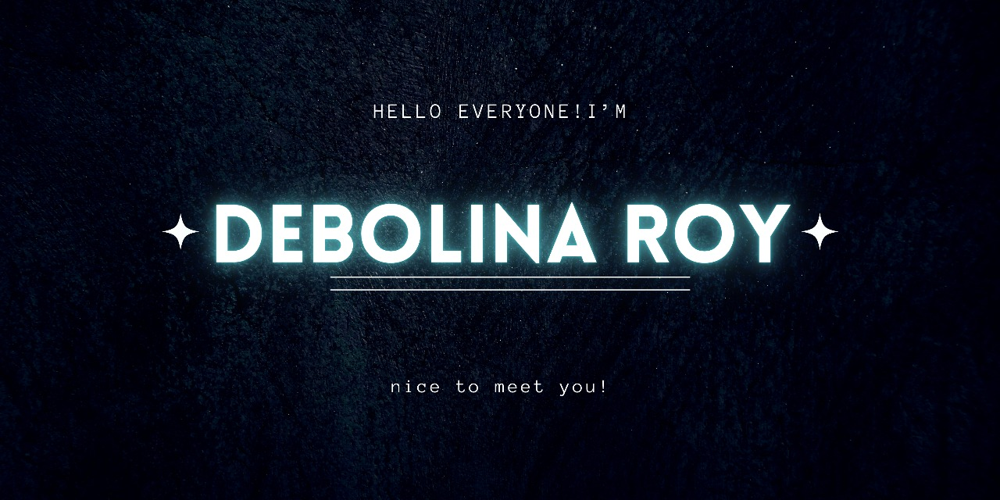

🔗 Click the banner above to visit my [LinkedIn](https://www.linkedin.com/in/debolina-roy-293462343/)

# 👋 Hello, I'm Debolina Roy

*Aspiring Java Full-Stack Developer | Passionate about Building Scalable & Efficient Software Solutions*

---

## 🚀 Current Focus

- Exploring **Java Full-Stack Development** with an emphasis on **Spring Boot**, **REST APIs**, and **modern front-end frameworks**.
- Strengthening **Data Structures & Algorithms** for technical interviews.
- Aiming for **Java full stack development roles** in innovative tech-driven companies.

---

## 🎓 Education

- **B.Tech in Computer Science & Engineering** (Pre-final Year, 2023–2027)

---

## 💼 Experience & Achievements

- **Participant** – Smart India Hackathon 2023 and 2024. 

---

## 🛠 Tech Stack

---

## 📫 Connect with Me

---

## 💡 Fun Facts

- I enjoy exploring **new tech stacks** and applying them to practical projects.
- I believe in **writing clean, maintainable, and scalable code**.
- Outside of coding, I’m passionate about **tech communities and hackathons**.

---

## 🤝 Let's Collaborate

I’m open to contributing to **Java, Spring Boot, and full-stack projects**.  
If you have an idea or project in mind, feel free to connect!

---
